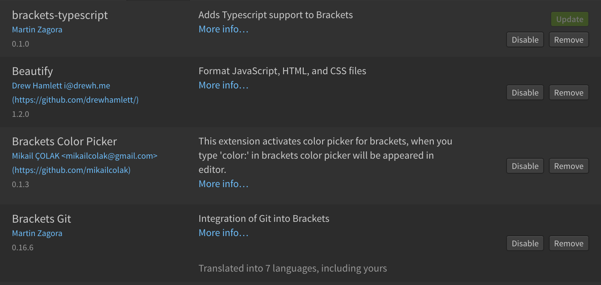
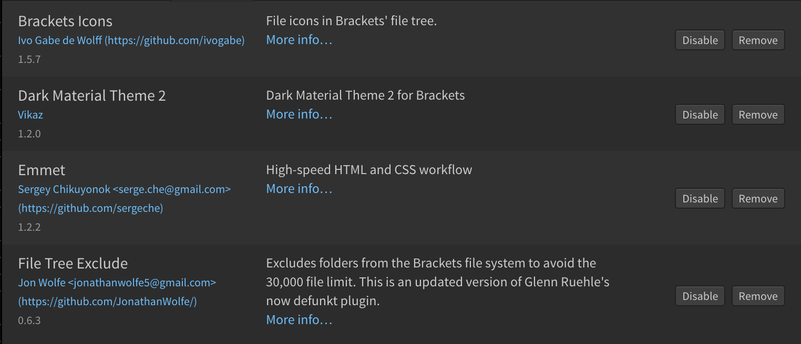
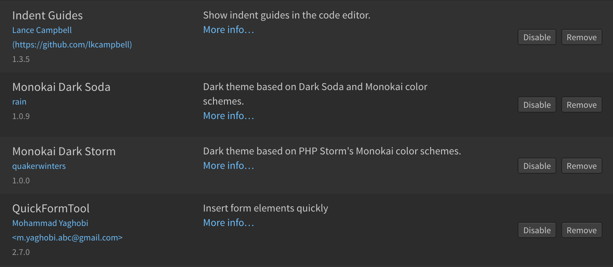
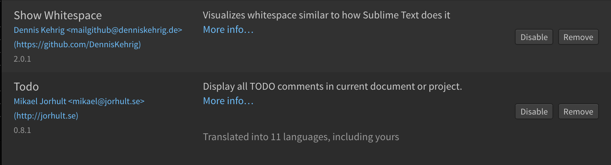

<<<<<<< HEAD
# BapMarine2017

Continuation du projet [BapMarineNationale](https://github.com/NicolasGauvin/BapMarineNationale) **Editeur de Code :**  
[Brackets](http://brackets.io/)  
**Mes Plugins Brackets :**    

## Installation de Git (Mac) :

1\. Téléchargez et installez [Git for Mac](https://git-scm.com/downloads) 2\. Téléchargez et installez [iTerm 2](https://www.iterm2.com/downloads.html). Ceci est votre **Terminal** dans laquelle vous ferez vos commandes Git. 3\. Passez à la [mise en place des fichiers.](#anchor1)

## Installation de Git for Windows (Windows):

1\. Téléchargez [Git for Windows](https://github.com/git-for-windows/git/releases/v2.10.2.windows.1) (en bas de la page). 2\. Installez dans "C:/Program Files/Git", puis séléctionnez toutes les cases sauf la dernière, puis séléctionnez "Use Git from Git Bash only", puis laissez tout par défault. 3\. Trouvez Git Bash sur votre Bureau et lancez-le. Ceci est votre **Terminal** dans laquelle vous ferez vos commandes Git. 4\. Passez à la [mise en place des fichiers.](#anchor1)

## Mise en place des fichiers :

**ATTENTION le chemin vers htdocs est :**  
• "C:/MAMP/htdocs" pour Windows  
• "/Applications/MAMP/htdocs" pour Mac 1\. Dans le dossier htdocs , créez un dossier qui sera votre dossier du projet. 2\. Ouvrez votre le Terminal et tapez  
• `cd C:/MAMP/htdocs/votre_dossier` (Windows)  
• `cd /Applications/MAMP/htdocs/votre_dossier` (Mac)  
et appuyez sur Entrée. 3\. Puis tapez `git clone https://github.com/jblafon/BapMarine2017.git` et appuyez sur Entrée.

## Commandes Git

Git va nous permettre de travailler sur le même projet en même temps mais **NE JAMAIS MODIFIER SUR LES MÊMES LIGNE D'UN MÊME FICHIER EN MÊME TEMPS !!!**

### Envoyer un fichier vers le git :

1\. ouvrir le Terminal 2\. tapez  
• `cd C:/MAMP/htdocs/votre_dossier/BapMarine2017` (Windows)  
• `cd /Applications/MAMP/htdocs/votre_dossier/BapMarine2017` (Mac) 3\. tapez `git add le_fichier_modifié.html` pour ajouter le fichier à la liste de push (répetez si vous avez modifié plusieurs fichiers) 4\. tapez `git commit -m "descriptif de vos modifs"` **N'oubliez pas de décrire vos modifs svp** 5\. tapez `git origin master`

### Récuperer les fichier depuis le Git :

1\. ouvrir le Terminal 2\. tapez  
• `cd C:/MAMP/htdocs/Votre_dossier/BapMarine2017` (Windows)  
• `cd /Applications/MAMP/htdocs//Votre_dossier/BapMarine2017` (Mac) 3\. tapez `git pull`

## Mise en place de la base de donnée :

### Importation de la base de données:

1\. Allez sur PhpMyAdmin de votre localhost. 2\. Créez une nouvelle base de donnée en collation `utf8_general_ci`. 3\. Cliquez sur la base de donnée puis sur l'onglet "Import" et importez le fichier "votre_dossier/BapMarine2017/sql/marine_nationale_db.sql".

### Changement des identifiants de connection à la base de donnée:

1\. Dans "BapMarine2017", créez un fichier "db.php" 2\. Ouvrez le fichier "db.php.example" et copiez le contenu dans "db.php" 3\. Remplacer la ligne 6 par `$db = 'votre_base_de_données';` (_ATTENTION_ : ne pas supprimer ou renommer le fichier initial)  

## Architecture du code :

_index.php_|page d'accueil  
_load.php_|script php récupérant les informations d'une sauvagarde si la page actuelle est une carte sauvagardée  
_map.php_|page principale du projet; c'est la page où on trouve la carte  
_sauveguarde.php_|script php permettant de sauveguarder une nouvelle carte ou d'écraser une sauvegarde existant  
_delete.php_|script php permettant de supprimer une carte  
_db.php.example_|voir setup de l'installation partie 2  
_.gitignore_|fichier empechant le partage de db.php (voir setup) pour ne pas créer des conflits  
**dossier sql**  
_save_marine_db.sql_|fichier d'export de la base de données  
_save_marine_table.sql_|fichier d'export de la table sql  
**dossier image**  
toutes les pictos, les image d'unités ou d'éléments  
**dossier js**  
_coord.js_|fichier comprenant les coordonnées de la carte ainsi que la fonctionalité de filtres  
_function.js_|fichier comprenant des scripts de de mise en page (sidebar...) et une partie de la fonctionnalité de radar  
_icone.js_|fichier comprenant toutes les icones (principalement les icones d'unités)  
_jquery.tubular.js_|script d'affichage de la vidéo d'index  
_leaflet.js_|fichier js de la librairie leaflet  
_leaflet-src.js_|fichier js de la librairie leaflet  
_map.js_|fichier principale de js. Gestion des bateaux, des formes, du radar, du chargement de la sauvegarde...  
_onglet.js_|fichier js de gestion des onglets dans les paramètres  
_sauveguarde.js_|fichier de sauveguarde (principalement de preparation de la save des bateaux)  
_scriptIndex.js_|divers scripts d'affichage de la page index.php  
**dossier css**  
_leaflet.css_|fichier de style de la librairie leaflet  
_reset.css_|ficher de style pour reste les charactéristiques de chaque naviguateurs  
_screen.css_|fichier de style du plugin de vidéo tubular  
_style.css_|fichier de style d ela page map.php  
_styleIndex.css_|fichier de style de la page index.php
=======
<h1> BapMarine2017 </h1>

Continuation du projet <a href="https://github.com/NicolasGauvin/BapMarineNationale">BapMarineNationale</a>

<strong>Editeur de Code :</strong> 
<a href="http://brackets.io/">Brackets</a> 
<strong>Mes Plugins Brackets :</strong>

<h2>Installation de Git (Mac) :</h2>

1. Téléchargez et installez <a href="https://git-scm.com/downloads">Git for Mac</a>
2. Téléchargez et installez <a href="https://www.iterm2.com/downloads.html">iTerm 2</a>. Ceci est votre <strong>Terminal</strong> dans laquelle vous ferez vos commandes Git.
3. Passez à la <a href="#anchor1">mise en place des fichiers.</a>

<h2>Installation de Git for Windows (Windows):</h2>

1. Téléchargez <a href="https://github.com/git-for-windows/git/releases/v2.10.2.windows.1">Git for Windows</a> (en bas de la page).
2. Installez dans "C:/Program Files/Git", puis séléctionnez toutes les cases sauf la dernière, puis séléctionnez "Use Git from Git Bash only", puis laissez tout par défault.
3. Trouvez Git Bash sur votre Bureau et lancez-le. Ceci est votre <strong>Terminal</strong> dans laquelle vous ferez vos commandes Git.
4. Passez à la <a href="#anchor1">mise en place des fichiers.</a>

<h2 id="anchor1">Mise en place des fichiers :</h2>

<strong>ATTENTION le chemin vers htdocs est :</strong>  
• "C:/MAMP/htdocs" pour Windows 
• "/Applications/MAMP/htdocs" pour Mac

1. Dans le dossier htdocs , créez un dossier qui sera votre dossier du projet.
2. Ouvrez votre le Terminal et tapez 
	• <code> cd C:/MAMP/htdocs/votre_dossier </code> (Windows) 
	• <code> cd /Applications/MAMP/htdocs/votre_dossier </code> (Mac) 
et appuyez sur Entrée.
3. Puis tapez <code> git clone https://github.com/jblafon/BapMarine2017.git </code> et appuyez sur Entrée.

<h2>Commandes Git</h2>

Git va nous permettre de travailler sur le même projet en même temps mais <strong>NE JAMAIS MODIFIER SUR LES MÊMES LIGNE D'UN MÊME FICHIER EN MÊME TEMPS !!!</strong>

<h3>Envoyer un fichier vers le git :</h3>
1. ouvrir le Terminal
2. tapez 
	• <code> cd C:/MAMP/htdocs/votre_dossier/BapMarine2017 </code> (Windows) 
	• <code> cd /Applications/MAMP/htdocs/votre_dossier/BapMarine2017 </code> (Mac)
3. tapez <code> git add le_fichier_modifié.html </code> pour ajouter le fichier à la liste de push (répetez si vous avez modifié plusieurs fichiers)
4. tapez <code> git commit -m "descriptif de vos modifs" </code> <strong>N'oubliez pas de décrire vos modifs svp</strong>
5. tapez <code> git origin master </code>

<h3>Récuperer les fichier depuis le Git :</h3>
1. ouvrir le Terminal
2. tapez 
	• <code> cd C:/MAMP/htdocs/Votre_dossier/BapMarine2017 </code> (Windows)  
	• <code> cd /Applications/MAMP/htdocs//Votre_dossier/BapMarine2017</code> (Mac)
3. tapez <code> git pull </code>

<h2>Mise en place de la base de donnée :</h2>

<h3>Importation de la base de données:</h3>

1. Allez sur PhpMyAdmin de votre localhost.
2. Créez une nouvelle base de donnée en collation <code>utf8_general_ci</code>.
3. Cliquez sur la base de donnée puis sur l'onglet "Import" et importez le fichier "votre_dossier/BapMarine2017/sql/marine_nationale_db.sql".

<h3>Changement des identifiants de connection à la base de donnée:</h3>
1. Dans "BapMarine2017", créez un fichier "db.php"
2. Ouvrez le fichier "db.php.example" et copiez le contenu dans "db.php"
3. Remplacer la ligne 6 par <code>$db = 'votre_base_de_données';</code>

(<i>ATTENTION</i> :  ne pas supprimer ou renommer le fichier initial) 

<h2>Architecture du code :</h2>

<i>index.php</i>|page d'accueil 
<i>load.php</i>|script php récupérant les informations d'une sauvagarde si la page actuelle est une carte sauvagardée 
<i>map.php</i>|page principale du projet; c'est la page où on trouve la carte 
<i>sauveguarde.php</i>|script php permettant de sauveguarder une nouvelle carte ou d'écraser une sauvegarde existant 
<i>delete.php</i>|script php permettant de supprimer une carte 
<i>db.php.example</i>|voir setup de l'installation partie 2 
<i>.gitignore</i>|fichier empechant le partage de db.php (voir setup) pour ne pas créer des conflits 

<strong>dossier sql</strong> 
    <i>save_marine_db.sql</i>|fichier d'export de la base de données 
    <i>save_marine_table.sql</i>|fichier d'export de la table sql 

<strong>dossier image</strong> 
    toutes les pictos, les image d'unités ou d'éléments 
  
<strong>dossier js</strong> 
    <i>coord.js</i>|fichier comprenant les coordonnées de la carte ainsi que la fonctionalité de filtres 
    <i>function.js</i>|fichier comprenant des scripts de de mise en page (sidebar...) et une partie de la fonctionnalité de radar 
    <i>icone.js</i>|fichier comprenant toutes les icones (principalement les icones d'unités) 
    <i>jquery.tubular.js</i>|script d'affichage de la vidéo d'index 
    <i>leaflet.js</i>|fichier js de la librairie leaflet 
    <i>leaflet-src.js</i>|fichier js de la librairie leaflet 
    <i>map.js</i>|fichier principale de js. Gestion des bateaux, des formes, du radar, du chargement de la sauvegarde... 
    <i>onglet.js</i>|fichier js de gestion des onglets dans les paramètres 
    <i>sauveguarde.js</i>|fichier de sauveguarde (principalement de preparation de la save des bateaux) 
    <i>scriptIndex.js</i>|divers scripts d'affichage de la page index.php 
  
  <strong>dossier css</strong> 
    <i>leaflet.css</i>|fichier de style de la librairie leaflet 
    <i>reset.css</i>|ficher de style pour reste les charactéristiques de chaque naviguateurs 
    <i>screen.css</i>|fichier de style du plugin de vidéo tubular 
    <i>style.css</i>|fichier de style d ela page map.php 
    <i>styleIndex.css</i>|fichier de style de la page index.php 
>>>>>>> bitbucket/master
